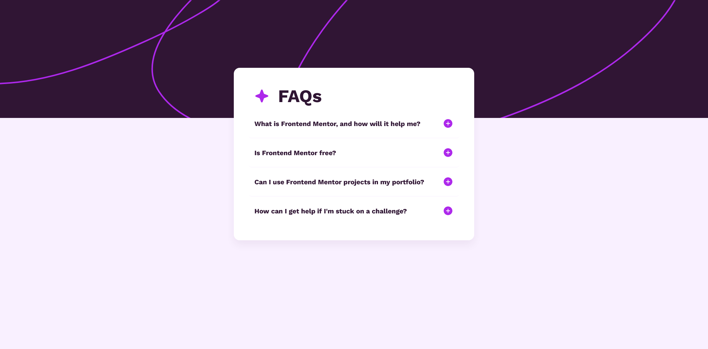
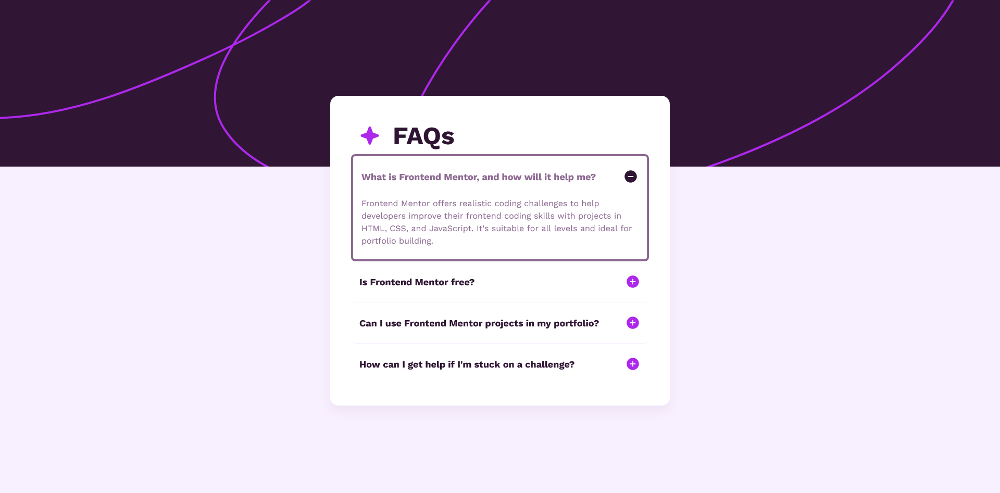

# Frontend Mentor - FAQ Accordion Solution

This is a solution to the [FAQ Accordion challenge on Frontend Mentor](https://www.frontendmentor.io/challenges/faq-accordion-wyfFdeBwBz). Frontend Mentor challenges help you improve your coding skills by building realistic projects.

## Table of contents

- [Overview](#overview)
  - [The challenge](#the-challenge)
  - [Screenshot](#screenshot)
  - [Links](#links)
- [My process](#my-process)
  - [Built with](#built-with)
  - [What I learned](#what-i-learned)
- [Author](#author)

## Overview

### The challenge

Users should be able to:

- Hide/Show the answer to a question when any area within the accordion section box is clicked.
- Navigate the questions and hide/show answers using keyboard navigation alone.
- View the optimal layout for the interface depending on their device's screen size.
- See high-contrast hover and focus states for all interactive elements on the page.
- Experience instant, flicker-free interactions if they have system motion restrictions enabled.

### Screenshot

<p align="center">
  
  
</p>

### Links

- [Solution URL](https://github.com/Kking927/faq-accordion)
- [Live Site URL](https://kking927.github.io/faq-accordion/)

## My process

### Built with

- Semantic HTML5 markup
- Custom CSS Properties
- CSS Flexbox
- Mobile-first responsive workflow
- Fluid Design Architecture utilizing mathematical `clamp()` functions
- CSS Logical Properties for semantic spatial styling
- Vanilla JavaScript for programmatic state management

### What I learned

This project provided an opportunity to improve my skills with layout architecture, strict web accessibility (WCAG) guidelines, and performance-driven CSS.

Here are the major technical milestones I achieved during this project:

#### 1. Coding Smooth Accordion Elements
I learned how to construct a robust accordion layout that toggles content visibility without causing sudden visual jumps. By coupling CSS transitions with a max-height state change, the dropdown panels slide open gracefully.

```css
.accordion-content {
  max-height: 0;
  overflow: hidden;
  transition: max-height 0.35s cubic-bezier(0.4, 0, 0.2, 1);
}

.accordion-item.active .accordion-content {
  max-height: 16rem;
}
```

#### 2. Utilizing Event Bubbling for Layout Interactions
I attached a single event listener to each `.accordion-header`. Because of browser event bubbling, when a user clicks on any inner child element—such as the text string or the SVG icon—the click event automatically propagates upwards to the parent header container, executing the toggle function cleanly without needing separate trackers for the internal assets.

```javascript
const accordionHeaders = document.querySelectorAll('.accordion-header');

accordionHeaders.forEach(header => {
  header.addEventListener('click', () => {
    const accordionItem = header.parentElement;
    const icon = header.querySelector('.accordion-icon');
    
    // Toggle the active class on the parent item container
    accordionItem.classList.toggle('active');
    
    // Check if the item is now open and swap the image source accordingly
    if (accordionItem.classList.contains('active')) {
      icon.src = 'images/icon-minus.svg';
    } else {
      icon.src = 'images/icon-plus.svg';
    }
  });
});
```
    
## Author

- Frontend Mentor - [@Kking927](https://www.frontendmentor.io/profile/Kking927)
